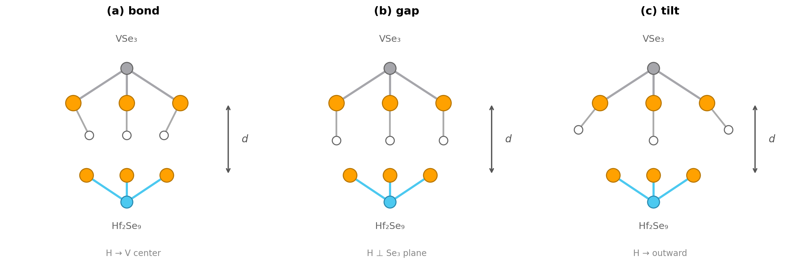
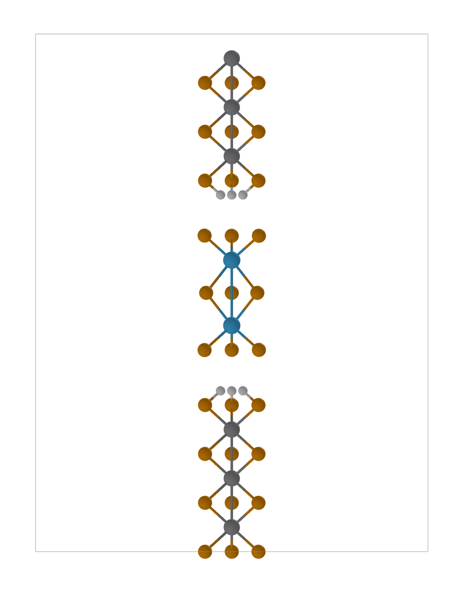
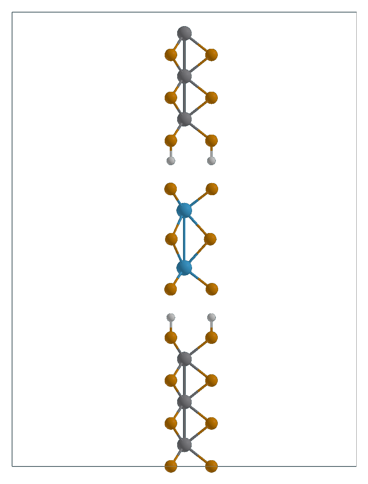
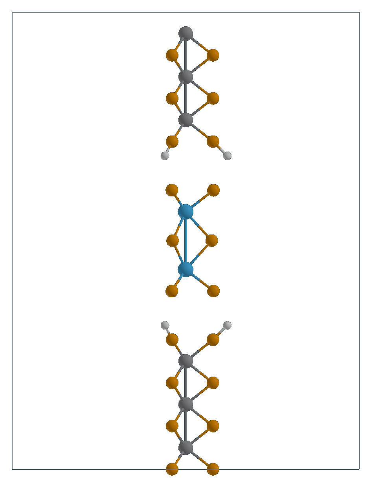
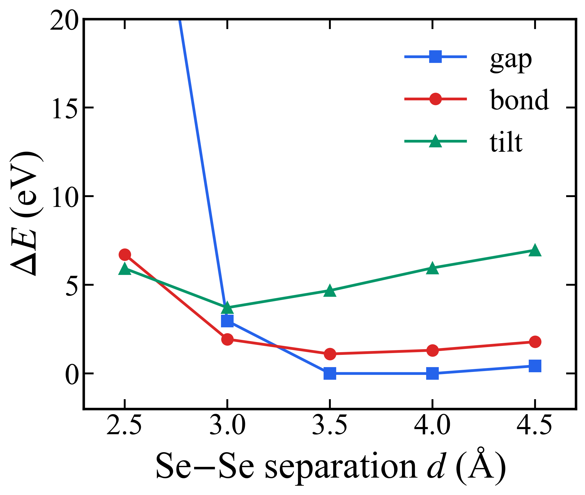

# Meeting — TBC

## Progress Report

### 지난 미팅 (2026-04-07) 합의 사항

#### Discussion

- 기존 heterostructure separation curve가 실험 거리 부근에서 minimum을 만들지 못하므로, `VSe3 terminal Se dangling bond`가 비물리적 강결합의 원인일 가능성을 먼저 검증한다.
- CNT encapsulation은 우선순위를 낮추고, heterostructure 안정화 해석에 집중한다.
- 납득 가능한 relaxed heterostructure를 얻으면 그 구조를 바로 transport 계산으로 연결한다.

#### Action Items

| Action Item | Status |
|---|---|
| VSe3 측 terminal Se에 H termination 추가 후 H 있음/없음 비교 | [x] |
| 헤테로 relax 완료 시 transport 계산 셋업 | [ ] |
| 이양진 박사님께 VSe3 TAP relaxed 구조 전달 | [x] |

### 이번 미팅 핵심 결과

#### 1. H termination 방향 비교

- 세 가지 초기 H 방향 `bond`, `gap`, `tilt`를 비교했다.
- 계산 조건은 `vdW-DF2 single-point`, `44 atoms`, `Se-H = 1.46 Å`로 통일했다.
- 여기서 `d`는 `VSe3 terminal Se - Hf2Se9 terminal Se` 사이의 z 방향 거리이다.

| bond (H→V center) | gap (H⊥Se3) | tilt (H→outward) |
|---|---|---|
|  |  |  |

**핵심 결론**

- `gap` 모드가 전체 범위에서 가장 안정하다.
- `gap`의 minimum은 `d = 3.5-4.0 Å` 구간에 있으며, 두 점의 차이는 `4 meV` 수준으로 사실상 거의 같다.
- `bond`는 `gap`보다 `1.11 eV` 높고, `tilt`는 `3.72 eV` 높다.
- 따라서 다음 relaxation 초기 구조는 `gap 모드, d = 3.5 Å`로 두는 것이 가장 합리적이다.

#### 2. H termination이 separation curve를 정상화

**핵심 결론**

- H를 붙이지 않으면 에너지가 separation 감소에 따라 계속 낮아져 equilibrium distance가 나오지 않는다.
- H를 붙이면 `d = 3.5 Å`에서 minimum이 생기며, 이는 실험 separation과 잘 맞는다.
- 현재 해석은 `VSe3 terminal Se dangling bond`가 과도한 계면 결합의 주 원인이었고, H passivation이 그 효과를 제거했다는 것이다.

#### 3. 실험팀 전달 사항

이양진 박사님께 `VSe3 TAP relaxed` 구조를 전달했다.

- `vdW-DF2 relaxed`
- `c = 5.535 Å`
- `V-Se = 2.508 Å`
- `V-V = 2.768 Å`

### 요약 메시지

- 이번 단계에서 가장 중요한 결과는 `H termination을 넣으면 실험과 맞는 separation minimum이 회복된다`는 점이다.
- 따라서 다음 계산의 기준 구조는 `gap 모드, d = 3.5 Å`로 정리할 수 있다.
- relaxation 결과까지 확보되면, dangling-bond passivation 가설을 훨씬 강하게 주장할 수 있다.

---

## 논의할 사항

### 1. 다음 계산 경로

- `gap 모드, d = 3.5 Å`를 relaxation 초기 구조로 바로 채택할지

### 2. 실험팀 공유 구조 기준

- 아직 어떤 H 방향이 가장 물리적으로 타당한지 완전히 정해지지 않았으므로, 실험팀에 공유할 초기 구조를 `gap 모드` 기준으로 할지, 아니면 `bond (H→V center)` 기준으로 할지

---

## Meeting Notes

### Discussion

- 

### Decisions

- 

### Action Items

- [ ]
