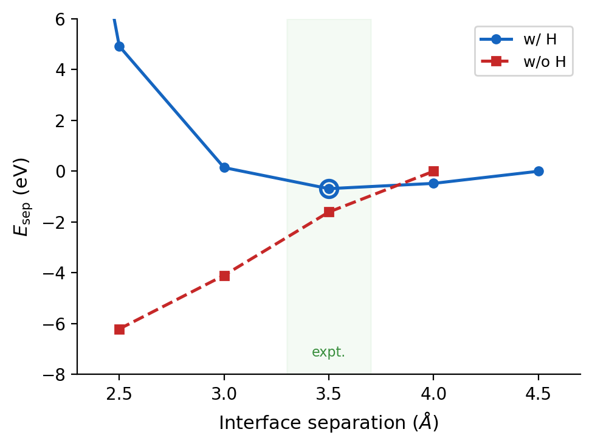

# VSe3–Hf₂Se₉ Heterojunction: H Termination으로 안정 구조 확보

## 요약

VSe3–Hf₂Se₉–VSe3 1D heterojunction의 interface separation energy를 DFT(vdW-DF2)로 계산했습니다. 기존에는 separation 거리 d = 2.5–4.0 Å 전 구간에서 에너지가 단조 감소하여 실험에서 관측되는 ~3.5 Å equilibrium 거리를 재현하지 못했습니다.

VSe3 chain을 절단한 단면의 Se에 **dangling bond**가 남아 있어 비물리적으로 강한 결합을 유발한다는 가설에 따라, VSe3 측 interface Se에 H를 부착하여 dangling bond를 passivate한 결과, **d = 3.5 Å에서 separation energy minimum이 출현**했습니다. 이는 실험 관측값과 일치합니다.

---

## 문제

이전 계산(H 없음)에서 VSe3–Hf₂Se₉ interface의 separation energy:

| d (Å) | E_sep, vdW-DF2 대칭 (eV) | E_sep, PBE+D2 대칭 (eV) |
|---|---|---|
| 2.5 | −6.21 | −8.31 |
| 3.0 | −4.10 | −4.89 |
| 3.5 | −1.61 | −1.84 |
| 4.0 | 0.00 (ref) | 0.00 (ref) |

전 구간 단조 감소 — **equilibrium 거리가 존재하지 않음**. Relaxation 시 VSe3와 Hf₂Se₉가 비물리적으로 가까워지거나 구조가 붕괴하는 원인.

---

## 가설

VSe3 TP chain의 각 Se는 위아래 두 V와 결합(V-Se = 2.508 Å). Chain을 절단하면 한쪽 V가 사라지면서 **Se에 dangling bond가 남음**. 이 unsaturated bond가 Hf₂Se₉와 비물리적으로 강하게 상호작용하여 interface 에너지를 왜곡.

Hf₂Se₉ molecule은 closed-shell이므로 dangling bond 문제는 **VSe3 측에 한정**.

---

## 방법

- VSe3 interface Se 3개에 H를 부착 (양쪽, 총 6개 H)
- H 배치: 사라진 V 방향 (Se-H bond가 원래 V-Se bond 방향과 일치)
- d(Se-H) = 1.46 Å (H₂Se 실험값, NIST CCCBDB)
- Single-point scan: d = 2.0, 2.5, 3.0, 3.5, 4.0, 4.5 Å
- Functional: vdW-DF2 (LMKLL), MeshCutoff 500 Ry, k = 1×1×4
- 44 atoms (6V + 2Hf + 30Se + 6H), VSe3 3uc 양쪽

---

## 결과

| d (Å) | E_sep, w/ H (eV) | E_sep, w/o H (eV) |
|---|---|---|
| 2.0 | +26.90 | — |
| 2.5 | +4.92 | −6.21 |
| 3.0 | +0.15 | −4.10 |
| **3.5** | **−0.68 (min)** | −1.61 |
| 4.0 | −0.48 | 0.00 |
| 4.5 | 0.00 (ref) | — |

**H termination 시 d = 3.5 Å에서 명확한 minimum 출현.** 실험 ~3.5 Å과 일치.

H가 없는 bare 구조는 여전히 단조 감소(d = 2.5→4.0 Å에서 −6.21→0.00 eV).

---

## 해석

- H가 Se dangling bond를 passivate하면 interface의 비물리적 강결합이 제거됨
- d < 3.0 Å: H-Hf₂Se₉ 간 Pauli repulsion으로 에너지 급상승 (repulsive wall)
- d ~ 3.5 Å: vdW attraction과 repulsion의 균형 → equilibrium
- d > 4.0 Å: vdW interaction 감소, 에너지 수렴

이 결과는 **VSe3 Se dangling bond가 이전 계산 실패의 주 원인**이었음을 보여줌.

---

## 현재 진행 중

- H 방향 sensitivity test: bond(완료) 외에 gap, tilt 두 가지 모드 추가 계산 중
- 세 모드 비교 후 가장 물리적인 구조로 relaxation → transport 계산 예정

---

## 다음 단계

1. H 방향 확정 (bond/gap/tilt 비교)
2. 20uc급 구조로 full relaxation (transport 크기)
3. Hf₂Se₉ PDOS → band gap 확인
4. TranSIESTA transport 계산 (electrode + device + I-V)
